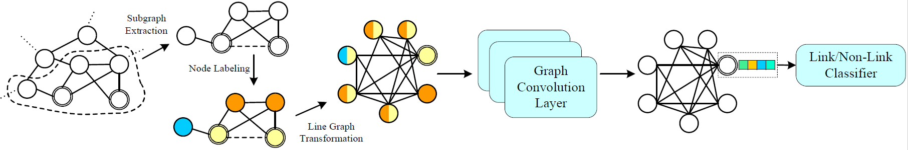

# Line Graph Neural Networks for Link Prediction


## Introduction

Pytorch implementation of [Line Graph Neural Networks for Link Prediction](https://arxiv.org/pdf/2010.10046.pdf).



## System requirement

#### Programming language
Python 3.5 +

#### Python Packages
Pytorch , Numpy , Networkx, PyTorch Geometric

#### Datasets

Raw datasets are obtained from https://noesis.ikor.org/datasets/link-prediction. Datasets are processed and saved into mat file.

## Training 

#### Train the network

```
cd LGLP/Python
python Main.py --data-name=BUP --test-ratio=0.5
```


## Acknowlegdements

Part of code borrow from https://github.com/muhanzhang/SEAL and https://github.com/muhanzhang/DGCNN. Thanks for their excellent work!
